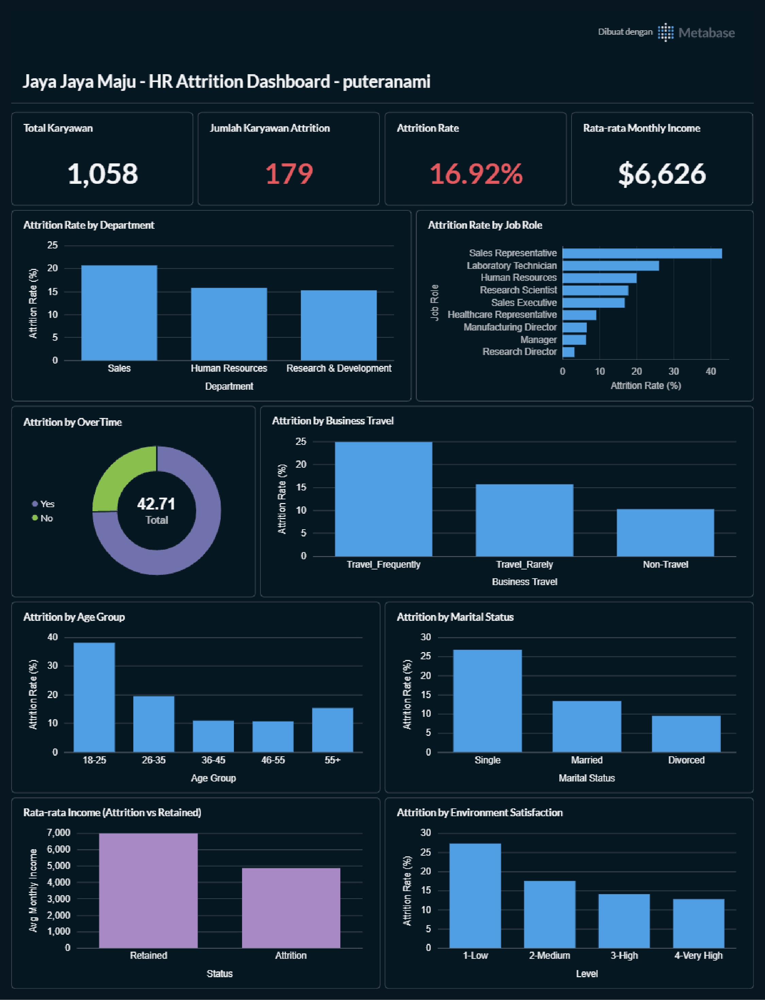

# Proyek Akhir: HR Employee Attrition Analysis - Jaya Jaya Maju

## Business Understanding

Jaya Jaya Maju merupakan salah satu perusahaan multinasional yang telah berdiri sejak tahun 2000. Perusahaan ini memiliki lebih dari 1000 karyawan yang tersebar di seluruh penjuru negeri. Walaupun telah menjadi perusahaan yang cukup besar, Jaya Jaya Maju masih menghadapi kesulitan dalam mengelola karyawan. Hal ini berimbas pada tingginya *attrition rate* (rasio jumlah karyawan yang keluar dengan total karyawan keseluruhan) hingga mencapai lebih dari 10%.

### Permasalahan Bisnis

Tingginya tingkat pergantian karyawan (*attrition rate* > 10%) ini merupakan permasalahan utama yang sedang dihadapi oleh manajemen perusahaan Jaya Jaya Maju. Masalah ini membawa beberapa konsekuensi bisnis yang serius bagi jalannya operasional perusahaan, di antaranya:
1. **Tingginya Beban Biaya Finansial**: Perusahaan harus mengeluarkan biaya yang signifikan untuk proses penarikan, rekrutmen, onboarding, serta pelatihan ulang (*retraining*) karyawan baru guna menggantikan karyawan yang keluar.
2. **Hilangnya Pengetahuan Institusional (*Institutional Knowledge*)**: Ketika karyawan berpengalaman keluar dari perusahaan, keahlian khusus, metode kerja efektif, dan pemahaman mendalam tentang ekosistem operasional yang mereka miliki ikut hilang, sehingga menurunkan efisiensi kerja tim.
3. **Penurunan Produktivitas & Risiko Burnout**: Kekosongan posisi menyebabkan beban kerja dialihkan sementara ke karyawan yang tersisa. Jika berlangsung lama, hal ini memicu kelelahan kerja (*burnout*) bagi karyawan lain, menurunkan moral tim, dan berujung pada penurunan kualitas kinerja perusahaan secara keseluruhan.

### Cakupan Proyek

Untuk mengatasi permasalahan bisnis tersebut, proyek ini memiliki cakupan teknis sebagai berikut:
1. **Eksplorasi Data (EDA)**: Melakukan analisis data eksploratif (Univariate, Bivariate, dan Multivariate) untuk menganalisis korelasi dan visualisasi hubungan antara fitur demografi/pekerjaan dengan status attrition.
2. **Preprocessing Data**: Membersihkan dataset dari missing values, melakukan encoding variabel kategorikal, scaling fitur numerik, serta mengatasi class imbalance dengan teknik SMOTE.
3. **Pembuatan Model Machine Learning**: Melatih model klasifikasi menggunakan algoritma *Gradient Boosting Classifier* dan mengoptimalkannya dengan penyesuaian threshold keputusan.
4. **Evaluasi Model**: Menganalisis performa model menggunakan *classification report*, *confusion matrix*, kurva *ROC-AUC*, dan analisis *Feature Importance*.
5. **Dashboard Analitis (Metabase)**: Merancang dan membuat business dashboard interaktif untuk memonitor metrik-metrik HR secara real-time.
6. **Deployment Lokal**: Menyediakan script klasifikasi interaktif (`prediction.py`) untuk memprediksi potensi attrition karyawan secara langsung melalui input CLI.

---

## Persiapan Proyek

### 1. Sumber Data
Dataset yang digunakan dalam proyek ini disediakan secara lokal di folder [data/employee_data.csv](file:///c:/Users/User/Documents/TUGAS%20TI/PORTFOLIO/Projects/JayaMaju/data/employee_data.csv). Penjelasan mengenai masing-masing dari 35 kolom/fitur data dapat dibaca secara lengkap pada berkas [README.md data](file:///c:/Users/User/Documents/TUGAS%20TI/PORTFOLIO/Projects/JayaMaju/data/README.md).

### 2. Membuat dan Mengaktifkan Virtual Environment (venv)
Sangat direkomendasikan untuk menggunakan Python Virtual Environment agar library yang digunakan tidak bertabrakan dengan environment global komputer Anda.

**Langkah-langkah pembuatan dan aktivasi venv:**
- **Windows (PowerShell / Command Prompt):**
  ```powershell
  # 1. Buat virtual environment bernama 'venv'
  python -m venv venv

  # 2. Aktifkan venv di PowerShell
  .\venv\Scripts\Activate.ps1
  # Atau di Command Prompt (cmd)
  .\venv\Scripts\activate.bat
  ```
- **macOS / Linux:**
  ```bash
  # 1. Buat virtual environment bernama 'venv'
  python3 -m venv venv

  # 2. Aktifkan venv
  source venv/bin/activate
  ```

### 3. Instalasi Dependencies
Setelah virtual environment aktif, pasang seluruh pustaka yang dibutuhkan dengan menjalankan perintah berikut:
```bash
pip install -r requirements.txt
```

### 4. Cara Mengakses dan Menjalankan Dashboard Metabase
Dashboard interaktif dibuat menggunakan **Metabase** untuk membantu tim HR memantau tren dan faktor pendorong attrition. Gunakan langkah-langkah terstruktur berikut untuk menjalankan dan mengakses dashboard:

* **Persyaratan:** Pastikan Docker Desktop sudah terpasang dan berjalan di komputer Anda.
* **Versi Metabase yang Digunakan:** `metabase/metabase:v0.46.4` (disarankan menggunakan versi latihan ini agar konfigurasi database ter-import dengan sempurna).

**Langkah-langkah Menjalankan Container:**
1. **Jalankan Container Metabase baru:**
   Jalankan container dengan memetakan port 3000 dan beri nama container `metabase`:
   ```bash
   docker run -d -p 3000:3000 --name metabase metabase/metabase:v0.46.4
   ```
2. **Salin File Database (`metabase.db.mv.db`) ke Dalam Container:**
   Metabase menyimpan konfigurasi dashboard dan kueri SQL di dalam database H2. Salin file database yang disertakan dalam repositori ini (`metabase.db.mv.db`) ke folder database metabase di dalam container:
   ```bash
   # Di terminal / command prompt pada root folder proyek, jalankan:
   docker cp metabase.db.mv.db metabase:/metabase.db/metabase.db.mv.db
   ```
3. **Restart Container Metabase:**
   Agar Metabase memuat ulang database yang baru disalin, jalankan restart pada container:
   ```bash
   docker restart metabase
   ```
4. **Akses Dashboard Melalui localhost:**
   Buka peramban (browser) Anda dan akses alamat **[http://localhost:3000](http://localhost:3000)**.
5. **Kredensial Akses Metabase:**
   Masuk ke dashboard menggunakan akun berikut:
   * **Email / Username**: `root@mail.com`
   * **Password**: `root123`

### Preview Business Dashboard
Berikut adalah tangkapan layar dari dashboard analitik yang berhasil di-deploy:


---

## Machine Learning Model

Proyek ini melatih model klasifikasi untuk memprediksi apakah seorang karyawan berpotensi melakukan *attrition* (keluar).

* **Model Terbaik**: `Gradient Boosting Classifier`
* **Metrik Evaluasi (Data Test)**:
  * **Akurasi**: 81.00%
  * **ROC-AUC**: 0.8045
  * **Attrition Recall**: 42.00% (Dioptimalkan menggunakan threshold kustom `0.30` agar dapat menangkap lebih banyak karyawan yang berisiko keluar).
* **Lokasi Berkas Model**:
  * Model Utama: `model/model.joblib`
  * Preprocessor Pipeline: `model/preprocessor.joblib`

### Penggunaan Script Prediksi (`prediction.py`)

Anda dapat menjalankan sistem prediksi attrition di terminal secara interaktif menggunakan data sampel ataupun input data manual:

```bash
python prediction.py
```

* **Menu Interaktif**:
  1. **Pilih 1**: Menggunakan data sampel karyawan (untuk keperluan demonstrasi).
  2. **Pilih 2**: Memasukkan data karyawan baru secara manual untuk diprediksi langsung oleh model.

---

## Conclusion & Business Implications

Proyek ini mengintegrasikan analisis data eksploratif (EDA) dan pemodelan prediktif machine learning untuk memahami dan menekan angka attrition karyawan di Jaya Jaya Maju.

### 1. Ringkasan Performa Model Machine Learning
Model machine learning berbasis algoritma **Gradient Boosting Classifier** berhasil dibangun dan dioptimalkan. Pada data pengujian (test set), model mencapai **Akurasi 81.00%** dengan skor **ROC-AUC sebesar 0.8045**. Untuk memaksimalkan kemampuan deteksi dini HR, threshold keputusan disesuaikan menjadi **0.30** sehingga menghasilkan **Attrition Recall sebesar 42.00%**. Penggunaan threshold kustom ini sangat penting karena meminimalkan risiko *false negative* (karyawan yang diprediksi bertahan, padahal sebenarnya berisiko tinggi untuk keluar).

### 2. Temuan Insight Utama (Faktor Pendorong Attrition)
Berdasarkan hasil EDA dan *Feature Importance* model, faktor-faktor utama yang mendorong karyawan keluar adalah:
* **Kompensasi dan Gaji Bulanan (*Monthly Income*)**: Karyawan yang keluar memiliki rata-rata gaji bulanan yang jauh lebih rendah (~$4,787) dibandingkan dengan karyawan yang bertahan (~$6,832). Ketidakpuasan finansial merupakan salah satu pemicu utama.
* **Beban Kerja Lembur (*OverTime*)**: Karyawan yang bekerja lembur (*OverTime = Yes*) memiliki *attrition rate* mencapai 30%, jauh lebih tinggi dibandingkan dengan mereka yang tidak lembur (~10%). Beban kerja berlebih berdampak negatif pada retensi.
* **Opsi Saham (*Stock Option Level*) & Level Jabatan (*Job Level*)**: Karyawan dengan tingkat opsi saham dan level jabatan yang rendah (Job Level 1 & 2) memiliki tingkat kerentanan attrition tertinggi. Ketiadaan kepemilikan aset perusahaan memperkecil rasa loyalitas.
* **Masa Kerja Awal (*Years At Company*)**: Attrition paling tinggi terjadi pada rentang **0 hingga 2 tahun pertama** masa kerja. Setelah melewati tahun ke-3, retensi karyawan cenderung stabil.
* **Kepuasan Lingkungan Kerja (*Environment Satisfaction*)**: Karyawan dengan skor kepuasan lingkungan bernilai **1 (Low)** menunjukkan tingkat attrition di atas 25%.

### 3. Implikasi & Rekomendasi Bisnis
Dengan hasil pemodelan ini, departemen HR kini memiliki **sistem peringatan dini (early warning system)**. HR dapat menyaring database karyawan secara berkala menggunakan model prediktif untuk mengidentifikasi karyawan yang berada di zona risiko tinggi (*high attrition risk*). Langkah ini memungkinkan HR melakukan tindakan pencegahan secara proaktif (intervensi terarah) sebelum karyawan tersebut memutuskan keluar.

---

## Rekomendasi Action Items

Berdasarkan temuan konklusi di atas, berikut adalah 6 rekomendasi strategis konkret bagi manajemen Jaya Jaya Maju untuk menekan *attrition rate* di bawah 10%:

1. **Review Skema Lembur & Kesehatan Karyawan (Pencegahan Burnout)**
   * *Aksi*: Lakukan audit beban kerja dan kurangi lembur yang tidak perlu. Terapkan batas maksimum jam lembur mingguan dan sediakan kompensasi lembur yang lebih adekuat atau opsi insentif libur pengganti (*comp-off*).
2. **Salary Benchmarking & Penyelarasan Gaji Bulanan**
   * *Aksi*: HR harus meninjau ulang struktur gaji, terutama untuk level staf bawah (Job Level 1 & 2). Selaraskan gaji dengan standar pasar (benchmarking eksternal) untuk memastikan karyawan dibayar dengan adil.
3. **Penyempurnaan Struktur Karir & Pembagian Opsi Saham**
   * *Aksi*: Berikan rencana transisi karir yang transparan bagi karyawan baru sejak tahun pertama. Distribusikan program kepemilikan saham (*Stock Option*) dengan skema pencapaian target kerja tertentu untuk retensi jangka panjang.
4. **Penguatan Program Mentoring & Onboarding pada 1 Tahun Pertama**
   * *Aksi*: Sediakan sistem *Buddy* (rekan mentor) bagi karyawan baru di 6 bulan pertama. Lakukan wawancara evaluasi berkala di bulan ke-1, ke-3, dan ke-6 untuk mendeteksi dini masalah adaptasi.
5. **Perbaikan Fasilitas & Budaya Lingkungan Kerja**
   * *Aksi*: Buat survei kepuasan internal secara anonim per triwulan dan tindak lanjuti tim yang memiliki skor kepuasan rendah. Sediakan program fleksibilitas kerja seperti *hybrid working* atau jam kerja fleksibel untuk meningkatkan Work-Life Balance.
6. **Manajemen Penugasan Dinas (*Business Travel Rotation*)**
   * *Aksi*: Sediakan skema rotasi penugasan perjalanan dinas di divisi Sales dan R&D agar beban perjalanan dinas tidak menumpuk pada orang yang sama. Berikan tunjangan dinas luar kota yang menarik sebagai apresiasi.
